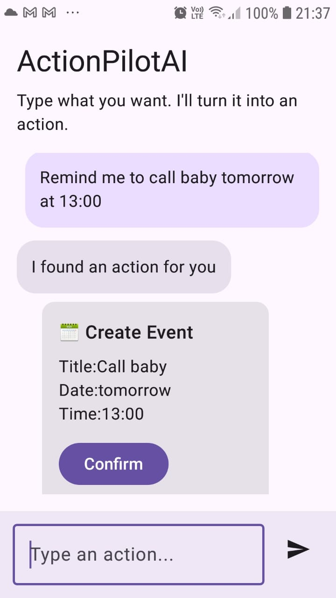
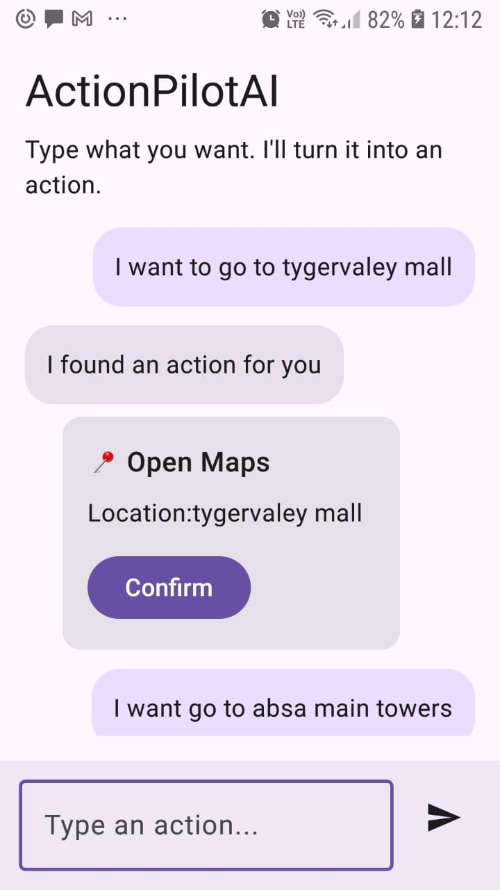

# ActionPilotAI 🚀

An AI-powered Android assistant that converts natural language into real actions like opening maps, scheduling events, and generating replies.

---

## ✨ Features

- 🧠 Natural language → structured actions (JSON)
- 📍 Open Google Maps from user intent
- 📅 Create calendar events
- 💬 Generate quick replies
- ⚡ Real-time AI integration using Gemini API
- 🎯 Clean architecture (MVVM + StateFlow)

---

## 🛠️ Tech Stack

- **Kotlin**
- **Jetpack Compose**
- **MVVM Architecture**
- **StateFlow**
- **Gemini API (HTTP integration)**
- **Android Intents**

---

## 📱 Screenshots
### Event Screen

---

## 🚀 Example

**Input:**