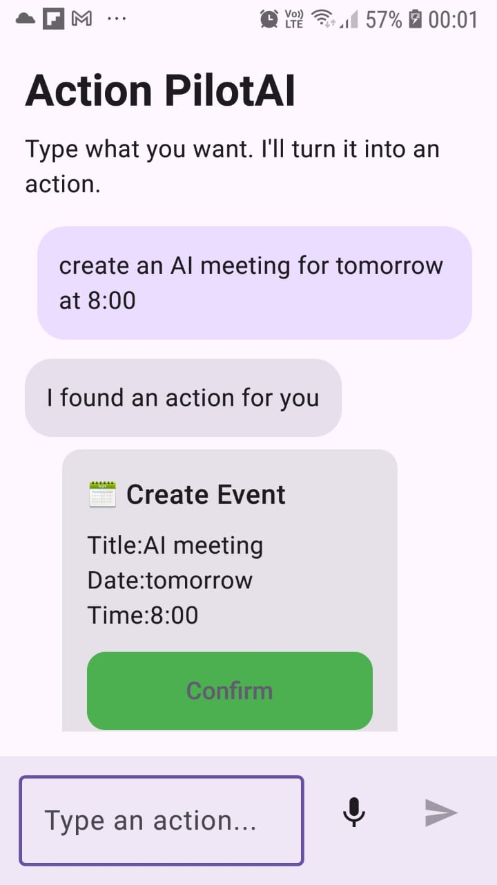
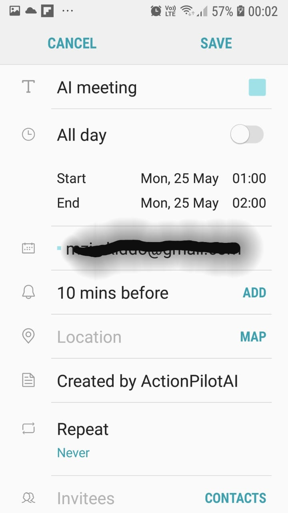
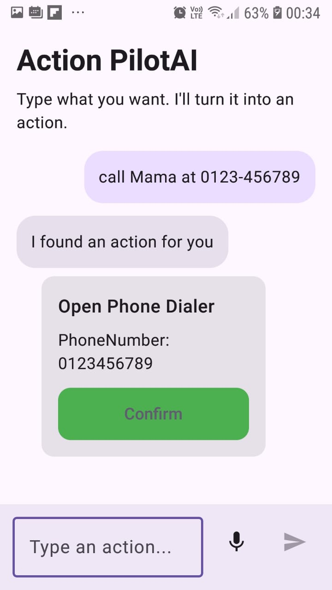
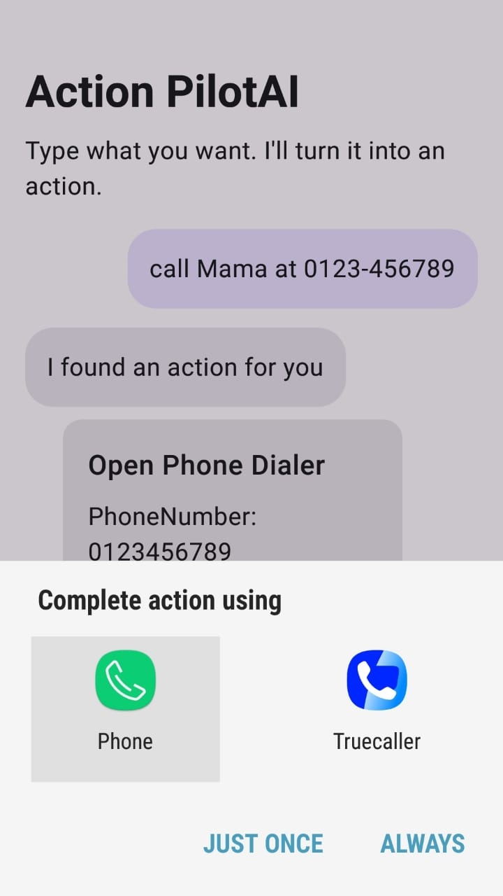
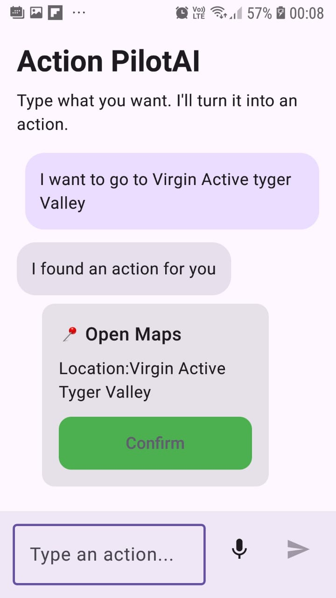

# ActionPilotAI 🚀

An AI-powered Android assistant that converts natural language into real device actions — call a contact, search the web, open maps, schedule events, share text, and more.

---

## ✨ Features

- 🧠 Natural language → structured actions via Gemini API
- 📍 Open Google Maps from user intent
- 📅 Create calendar events
- 💬 Generate quick replies
- 🔍 Search the web instantly
- 🌐 Open URLs directly
- 📞 Dial phone numbers
  🎤 Voice input support
- ⚡ Real-time AI integration using Gemini API
-  🎯 Clean MVI architecture with unidirectional data flow
---

## 🛠️ Tech Stack

- **Language = Kotlin**
- **UI = Jetpack Compose**
- **Architecture = MVI (Model-View-Intent)**
- **State Management = StateFlow + Channel**
- **AI Integration = Gemini API (HTTP integration)**
- **Device Actions = Android Intents**
- **Testing = JUnit - MockK - Turbine - Coroutines Test**
- **Code Quality = SonarCloud - JaCoCo**
- **CI/CD  =  GitHub Actions**

---

## 🤖 How It works

- **User types or speaks a natural language request**
- **Gemini API parses the intent and returns a structured action (JSON)**
- **ActionPilotAI maps the action to the correct Android Intent**
- **The device executes the action — opens maps, dials a number, creates an event, etc.**

## 📱 Screenshots
### Event Screen

---